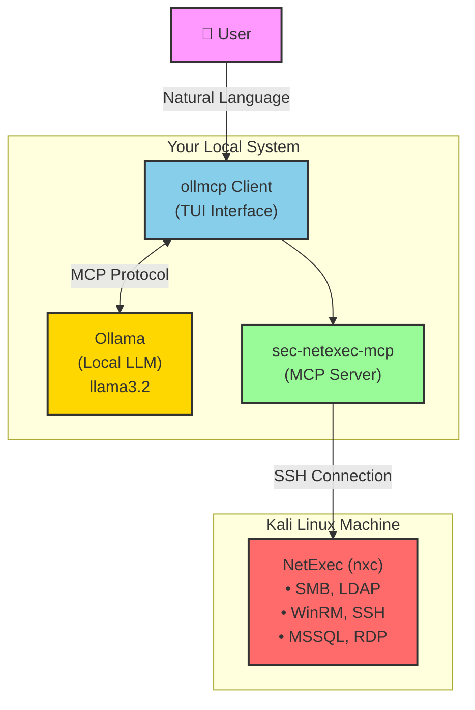
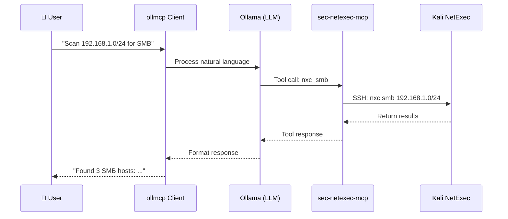

# 🔧 NetExec MCP Setup Guide with Ollama

A comprehensive guide to set up a fully local, free, and powerful AI-powered penetration testing environment using **NetExec**, **Model Context Protocol (MCP)**, and **Ollama**.

[](https://opensource.org/licenses/MIT)
[](http://makeapullrequest.com)

## 📋 Table of Contents
- [Overview](#-overview)
- [Architecture](#-architecture)
- [Prerequisites](#-prerequisites)
- [Quick Start](#-quick-start)
- [Step-by-Step Installation](#-step-by-step-installation)
- [Available Tools](#-available-tools)
- [Usage Examples](#-usage-examples)
- [Troubleshooting](#-troubleshooting)
- [Security Considerations](#-security-considerations)
- [License](#-license)

## 🎯 Overview

This guide enables you to interact with **NetExec** (a powerful network penetration testing tool) through an AI assistant using natural language. The entire stack runs locally and for free.

**Final Goal**: Execute network commands like `nxc_smb` through natural language conversations with a local AI model.

## 🏗️ Architecture



### Data Flow Explanation



## 📝 Prerequisites

### Hardware Requirements
- **At least 8GB RAM** (for running Ollama with a medium-sized model)
- **10GB free disk space** (for models and tools)

### Software Requirements
- **Kali Linux Machine** (or any Linux distribution with NetExec)
  - Can be a VM or remote server
  - SSH access enabled
- **Local System** (Windows, macOS, or Linux)
  - Node.js 18+
  - Python 3.8+
  - Git

## ⚡ Quick Start

### Windows
```powershell
# Run the automated setup script
.\scripts\setup-windows.ps1

# Start the MCP client
.\scripts\run-mcp.ps1
```

### Kali Linux
```bash
# Run the Kali setup script
bash scripts/setup-kali.sh
```

## 🛠️ Step-by-Step Installation

### Step 0: Install Prerequisites on Local System

#### Install Node.js
```bash
# Visit nodejs.org and download LTS version
node --version  # Verify installation
npm --version   # Verify installation
```

#### Install Python and pip
```bash
# Download from python.org
# Important: Check "Add Python to PATH"
python --version
pip --version
```

#### Install Git
```bash
# Download from git-scm.com
git --version
```

### Step 1: Prepare Kali Linux Machine

Access your Kali machine and execute:

```bash
# Update system
sudo apt update && sudo apt upgrade -y

# Install pipx
sudo apt install pipx -y
pipx ensurepath
source ~/.bashrc

# Install NetExec
pipx install git+https://github.com/Pennyw0rth/NetExec

# Verify installation
nxc --help

# Ensure SSH is running
sudo systemctl enable ssh --now
sudo systemctl status ssh

# Get your Kali IP
ip a | grep inet
```

### Step 2: Install and Configure MCP Tools on Local System

```bash
# Create project directory
mkdir ~/MCP-Projects
cd ~/MCP-Projects

# Clone and build sec-netexec-mcp
git clone https://github.com/schwarztim/sec-netexec-mcp.git
cd sec-netexec-mcp
npm install
npm run build

# Install ollmcp
pip install ollmcp
```

### Step 3: Configure MCP Server

Create `~/MCP-Projects/mcp-config.json`:

```json
{
  "mcpServers": {
    "netexec": {
      "command": "node",
      "args": ["~/MCP-Projects/sec-netexec-mcp/dist/index.js"],
      "env": {
        "KALI_HOST": "192.168.1.100",
        "SSH_USER": "kali",
        "SSH_KEY": "~/.ssh/id_rsa"
      }
    }
  }
}
```

### Step 4: Install Ollama

```bash
# Download from ollama.com
# Or use package manager
curl -fsSL https://ollama.com/install.sh | sh

# Pull a model
ollama pull llama3.2
```

### Step 5: Run Everything

```bash
ollmcp --servers-json ~/MCP-Projects/mcp-config.json --model llama3.2
```

## 🔧 Available Tools

| Tool | Purpose |
|------|---------|
| `nxc_smb` | SMB enumeration, share listing, credential dumping, command execution |
| `nxc_winrm` | WinRM remote management, PowerShell execution |
| `nxc_ssh` | SSH authentication testing, remote command execution |
| `nxc_ldap` | AD enumeration, Kerberoasting, ASREPRoast, BloodHound |
| `nxc_mssql` | SQL Server queries, xp_cmdshell execution |
| `nxc_rdp` | RDP credential validation, screenshot capture |
| `nxc_wmi` | WMI-based command execution |
| `nxc_spray` | Password spraying across all protocols |
| `nxc_modules` | List and query available modules |
| `nxc_shares` | SMB share enumeration and file operations |
| `nxc_raw` | Execute raw NetExec commands |

## 💻 Usage Examples

### SMB Enumeration
```
Use the nxc_smb tool to scan the network range 192.168.1.0/24 for SMB hosts.
```

### Password Spray Attack
```
Perform a password spray attack on 192.168.1.0/24 using the SMB protocol 
with the user list at /tmp/users.txt and password "Summer2024!"
```

### BloodHound Collection
```
Use nxc_ldap to perform a BloodHound collection on dc01.corp.local 
with username "admin" and password "P@ssw0rd"
```

### Pass-the-Hash Attack
```
Use nxc_smb with username "Administrator" and the hash 
"aad3b435b51404eeaad3b435b51404ee:5fbc3d5fec8206a30f4b6c473d68ae76" 
to enumerate shares on 192.168.1.10
```

### Module Management
```
List all available modules
```

## 🔧 Troubleshooting

### Common Issues

| Issue | Solution |
|-------|----------|
| **SSH Connection Refused** | Verify Kali IP, check SSH service, test firewall |
| **Cannot find module** | Run `npm install`, verify path in config |
| **Ollama not responding** | Check Ollama service, restart application |
| **Tools not detected** | Validate JSON syntax, check MCP connection |

### Diagnostic Commands

```bash
# Test Node.js
node -e "console.log('Node works!')"

# Test Python
python -c "print('Python works!')"

# Test Ollama
ollama list

# Test SSH
ssh -v kali@192.168.1.100
```

## 🔒 Security Considerations

> ⚠️ **WARNING**: This toolset is for **authorized security testing only**!

- **Always** obtain written authorization before testing any system
- **Never** use this against systems you don't own or have explicit permission to test
- **Keep your SSH keys secure** - never commit them to version control
- **Consider network isolation** - run tests in a lab environment
- **Log all activities** for proper audit trail
- **Follow legal and regulatory requirements** in your jurisdiction

### Best Practices
1. Use strong SSH keys (minimum 4096-bit RSA or ed25519)
2. Change default passwords on Kali machine
3. Keep Kali and all tools updated
4. Run tools with minimum required privileges
5. Regularly audit your configuration files

## 📜 License

This project is licensed under the MIT License - see the [LICENSE](LICENSE) file for details.

## 🤝 Contributing

Contributions are welcome! Please feel free to submit a Pull Request.

## 📚 References

- [NetExec Official Repository](https://github.com/Pennyw0rth/NetExec)
- [sec-netexec-mcp Repository](https://github.com/schwarztim/sec-netexec-mcp)
- [Ollama Official Website](https://ollama.com/)
- [MCP Protocol Documentation](https://modelcontextprotocol.ai/)

---

**Made with ❤️ by the security community**
